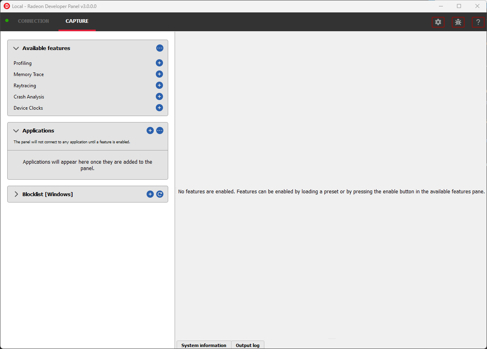
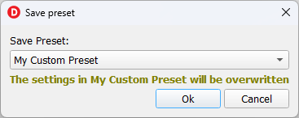

Capture
=======

After a connection is made to the service, the panel will switch to the
**Capture** tab.

The capture tab is structured as follows:

- :ref:`AvailableFeatures` - List of supported features for the active connection that can be enabled.

- :ref:`Applications` - List of actively or previously connected applications.

- :ref:`BlockedApplications` - List of applications blocked from connecting to the panel.

- :ref:`SystemInformation` - Lists detailed hardware and system information for the active local or remote connection.

- :ref:`OutputLog` - Displays log messages generated by the panel.

.. _AvailableFeatures:

Available features
------------------

The **Available features** section lists the available features for the current **Local** or **Remote** connection that can be enabled. Features in
this list can be enabled by clicking plus button next to the feature name.

.. NOTE::
    In some scenarios, features may not be available for enablement due
    to conflicts with other already enabled features as shown here:

.. image:: media/3.0/15_crash_analysis_warning.png

Presets
-------

Provides a set of enabled features and associated feature settings to create common capture workflows.

.. image:: media/3.0/29_presets.png

.. IMPORTANT::
    Changes to the enabled features and feature settings of a preset must be explicitly saved as shown below

.. _Applications:

Applications
------------

The **Applications** pane in Radeon Developer Panel contains the list of applications that have connected previously or
are currently connected to the panel.

Applications can connect to the panel under two auto connection modes:

   - **Any application** - Any application run that matches the selected API filter and is not contained in the blocklist will connect. Applications that are not already present in the application list will be added.

   - **Existing applications** - Only applications with entries specified in the application list that match the selected API filter will connect.

.. IMPORTANT::
    For using the **Existing applications** auto connect mode, applications can be added to the list using explicitly using
    the add button in the **Applications** pane.

Connections may also be filtered by a specific API such as **DirectX 12**, **Vulkan**, **OpenCL**, etc.

These modes can be configured by selecting the icon in the top right of the pane which will display the following dialog:

.. image:: media/3.0/18_application_filters.png

.. IMPORTANT::
      The **API** specified works as a filter against the client application
      accepting the driver connection. If you are unsure of what **API** is being used
      or don't care use the default **Any supported**

Once an application is added to the list, it can then be run on the system to
start a driver connection.

.. _BlockedApplications:

Blocked applications
--------------------

Sometimes it is useful to completely exclude certain background applications
from being recognized and displayed in the Radeon Developer Panel. For example,
Windows 10 has applications that use DirectX 12 and when they are started can
show up in the list of target applications. The **Profiling** feature also requires
that only one application is started while using the feature so blocking applications, such as launchers
that run before another application starts, can be useful.

The panel maintains a list of default applications that are blocked on either Windows or Linux.
This list can be viewed from the **Blocklist** pane
which will populate once a local or remote connection has been established.
Applications can be added or removed from the list by clicking one of the buttons below the list
of process names. When editing or removing entries, first select the process name
from the list then click the edit or remove button. The list can also be restored
to the default set of blocked applications. Right clicking on a process name in the
list will display context menu options to add, remove, or edit.

The blocked applications list supports wildcard matching. The following syntax is supported:
    * ? : Matches exactly one of any character
    * [...] : Matches one character in a set of characters
    * \* : Matches zero or more of any character

These can be escaped by using backslash.

Here are some examples of blocked application items that leverage the wildcard matching:
    * [Gg]ears.exe : Blocks any application called gears.exe with either a lowercase or uppercase G
    * gpu_info\* : Blocks any applications who's name starts with gpu_info
    * test?.exe : Blocks any application called test with a single character suffix -- e.g. test1 or test6

.. image:: media/3.0/20_blocked_apps.png

.. _SystemInformation:

System information
------------------

The system information pane lists detailed hardware and system information for the active Radeon Developer Panel connection. 

Pressing the Export button will open a dialog to choose a folder. Upon selecting a folder, the system information will be exported to that folder
as a JSON file.

.. image:: media/3.0/27_system_info.png

.. _OutputLog:

Output log
----------

Logging information about the connection and any errors encountered by Radeon Developer Panel or the Radeon Developer Service is
displayed here. The output log can be filtered by the source that produced the message or the process id that that message was relevant for.

.. image:: media/3.0/28_output_log.png

Selecting the **Open log file location** button will open the directory containing the log file.

| On Windows, this log is located at:
| "C:\\Users\\your_name\\AppData\\Roaming\\RadeonDeveloperPanel\\log.txt"

| On Linux, this log is located at:
| "~/.local/share/RadeonDeveloperPanel/log.txt"

