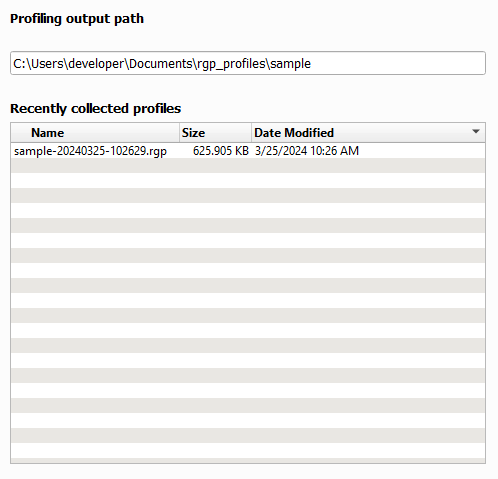
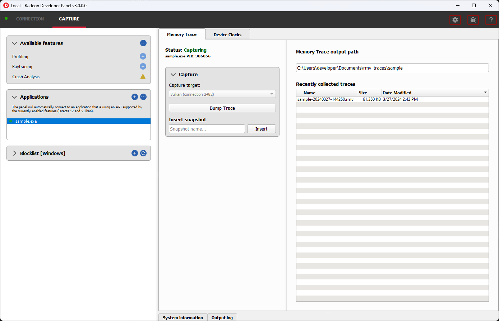
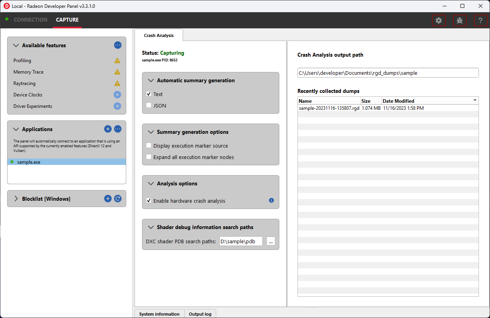
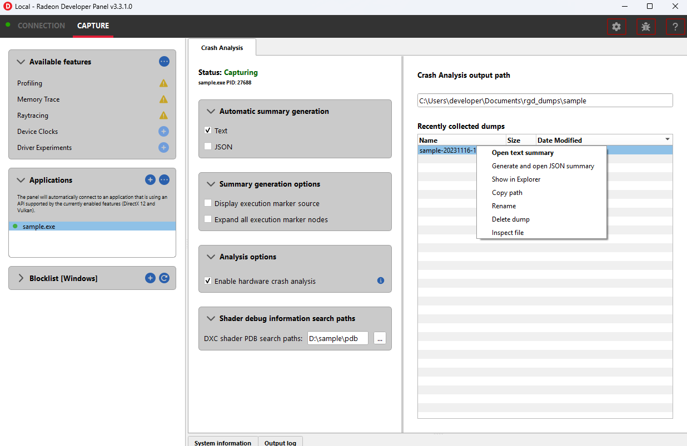
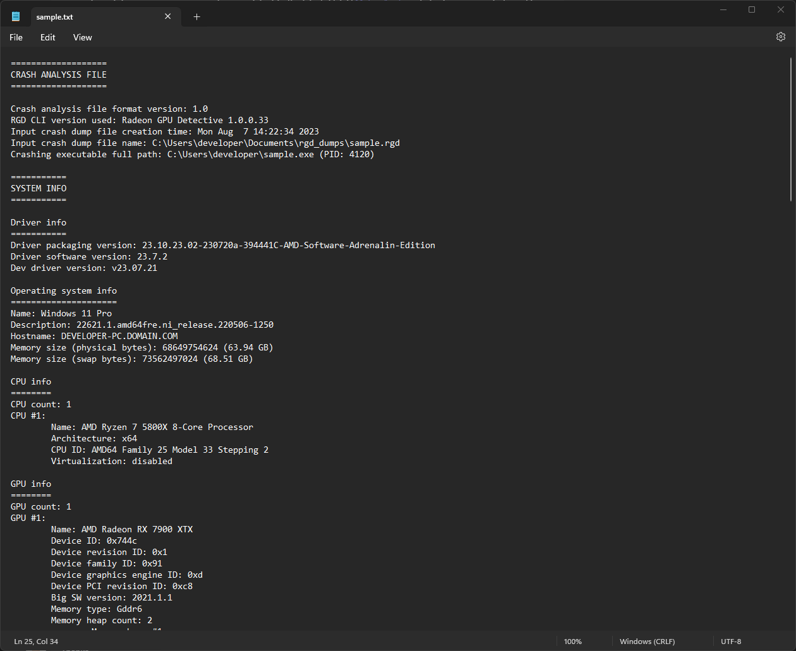

Features
========

Profiling
---------

This feature supports capturing a GPU profile for viewing in **Radeon GPU Profiler**.

.. image:: media/3.0/10_rgp_capture.png

The **Capture** section has the following items for profiling:

- **Capture target** - Selects the driver connection that should be profiled when a capture is triggered.

- **Capture profile** - Captures a profile and writes to disk.

- **Enable instruction tracing** - Enables capturing detailed instruction data.

- **Collect counters** - Enables capturing GPU cache counter data. Systems with an AMD Radeon RX 6000 or AMD Radeon RX 7000 series GPU will also collect raytracing counter data.

- **Delay capture** - If this is enabled, pressing the capture profile button or triggering the hotkey will first wait the entered number of milliseconds before capturing a profile.

.. NOTE:: Enabling capture of detailed instruction data may adversely affect performance.

The **Capture Settings** section has the following options for profiling:

- **SQTT Buffer Size**:
   * Defines the size of the buffer where SQTT data will be stored.
   * If a profile has missing data, the SQTT buffer size can be increased to potentially remedy the issue.
   * If an application experiences graphical corruption, decreasing the SQTT buffer size can potentially remedy the issue.

- **Enable shader instrumentation**
   * Enables support for capturing more detailed shader instrumentation data.

- **Auto capture**:
   * Displays configuration options for the trigger mode and dispatch range for profile capture.

   * **None** uses the default capture mode where clicking the **Capture profile** button will immediately
     capture the requested number of dispatches.

   * **Dispatch range** allows for setting the start and stop dispatch indices to use during automatic profile capture.

   * **Timer** allows for specifying the number of dispatches to capture after a specified elapsed time.

.. NOTE::
   To reduce the chance of truncated profile data, OpenCL profiling is limited to 10000 dispatches

Capturing a profile can be achieved by the following:

* **Click the Capture profile button**

   Clicking the **Capture profile** button from the Profiling UI will capture a frame and write the results to disk.

* **Use the Ctrl-Alt-C hotkey**

   Using Ctrl-Alt-C default hotkey on Windows or Linux® will capture a frame and write the results to disk.

   This can be configured **before launching an application** by clicking the edit button to the right of the hotkey label and then entering a series of key presses.

Example output:

   sample-20200908-092653.rgp

.. NOTE::
   Profiles will be output on disk at the path specified in the **Profiling output path** field shown below.

Memory Trace
------------

This feature enables capturing a memory trace for viewing in **Radeon Memory Visualizer**.

.. IMPORTANT::
   Memory tracing will have been implicitly started when the application was launched.

The **Capture** section has the following items for memory tracing:

-  **Capture target** - Selects the driver connection that should be dumped when the dump button is pressed.

-  **Dump trace** - Stops memory tracing for the selected capture target and writes results to disk.

-  **Insert snapshot** - insert user specified identifier to define snapshot in trace. A
   snapshot captures a moment in time in much the same way as a photograph. For example, to
   spot memory leaks, 2 snapshots can be added; one just before a game level is started after
   the menu screens and another snapshot when the game level finishes once the user is back in
   the game menus. Theoretically, the game should be in the same state in both cases (in the menus
   before and after a game level).

-  **Recently collected traces** - displays any recently collected traces in output directory

Writing out the memory trace to file can be achieved by one of the following:

* **Close the running application**

   When the client application terminates, the memory tracing
   will stop and the results will be written to disk.

* **Click the Dump trace button**

   Clicking the **Dump trace** button from the Memory Trace UI will stop
   memory tracing and write the results to disk.

Using either of the above methods to complete memory tracing
will result in a **Radeon Memory Visualizer** trace file being written to disk.

Example output:

   sample_20200316-143712.rmv

.. IMPORTANT::
      Once a memory trace has finished either through closing the application or
      through clicking the **Dump trace** button. The application **MUST** be
      closed and re-launched to start a new memory trace.

Raytracing
----------

This feature enables capturing a raytracing scene for viewing in **Radeon Raytracing Analyzer**.

.. image:: media/3.0/23_raytracing.png

The **Capture** section has the following items for raytracing:

- **Capture target** - Selects the driver connection that should have its raytracing scene captured when a capture is triggered.

- **Capture scene** - Captures a scene and writes to disk.

- **Delay capture** - If this is enabled, pressing the capture scene button or triggering the hotkey will first wait the entered number of milliseconds before capturing.

- **Collect ray dispatch data** - Captures detailed information about ray dispatches.

    .. NOTE::
        This feature is currently experimental on **Linux** and requires at least 16GB of system memory to work reliably in most cases.

- **Recently collected scenes** - Displays any recently collected scenes found in the output directory.

**Ray history** section allows for configuring settings for collecting ray dispatch data

- **Ray dispatch buffer size**:
   * Defines the buffer size in system memory used for allocating ray dispatch data during scene capture.

Capturing a scene can be achieved by the following:

* **Click the Capture scene button**

   Clicking the **Capture scene** button from the Raytracing UI will capture a raytracing scene and write the results to disk.

* **Use the Ctrl-F8 hotkey**

   Using Ctrl-F8 default hotkey on Windows or Linux® will capture a raytracing scene and write the results to disk.

   This can be configured **before launching an application** by clicking the edit button to the right of the hotkey label and then entering a series of key presses.

Example output:

   sample-20220705-104021.rra

Crash Analysis
--------------

This feature enables capturing a GPU crash summary using **Radeon GPU Detective**.

.. IMPORTANT::
    The following are requirements for crash analysis feature support

    **OS**: Windows® 10 or Windows® 11

    **GPU supported**: AMD Radeon RX 6000 or AMD Radeon RX 7000 series GPU

    **Minimum supported driver**: AMD Radeon Adrenalin Software Driver version 23.7.2

Before running an application to generate a crash dump, there are
a few settings that can be configured in the capture settings pane shown here:

- **Directory to store your dumps** - Path on disk where crash dumps are written out.

- **Automatic crash summary generation**

   For convenience, enabling these options will generate the respective crash dump summaries automatically upon capture.

- **Display execution marker source**

   If checked, each marker node in the generated summary file's
   execution marker tree will contain a tag specifying the source
   that generated the marker (such as Application, Driver, etc.).

- **Expand all execution marker nodes**

   If checked, all execution marker nodes in the marker tree will be expanded.

Once active, a GPU crash dump will be created once a TDR occurs.

Example output:

   sample-20230220-103954.rgd

Right clicking on a dump in the recently collected dumps pane will open a context menu with options to open the
generated crash summaries in the text editor specified in the Radeon Developer Panel settings. If a summary has not been
generated, an option will be present to first generate the summary using the Radeon GPU Detective CLI, then open
the summary. Deleting a dump from this context menu will also remove any summaries that have been generated.

.. NOTE::

    The Radeon GPU Detective executable path must be setup properly in the settings
    configuration to generate a crash summary.

Shown here is a sample crash dump summary:

Device Clocks
-------------

The Radeon Developer Panel (RDP) allows the developer to select from a
number of clock modes.

.. image:: media/3.0/17_device_clocks.png

Normal clock mode will run the GPU as it would normally run your
application. To ensure that the GPU runs within its designed power and
temperature envelopes, it dynamically adjusts the internal clock frequency.
This means that profiles taken of the same application may differ
significantly, making side-by-side comparisons impossible.

Stable clock mode will run the GPU at a lower, fixed clock rate. Even though
the application may run slower than normal, it will be much easier to compare
profiles of the same application.

.. NOTE::

    When capturing an RGP profile, clock modes for the device will be changed to peak during capture.
