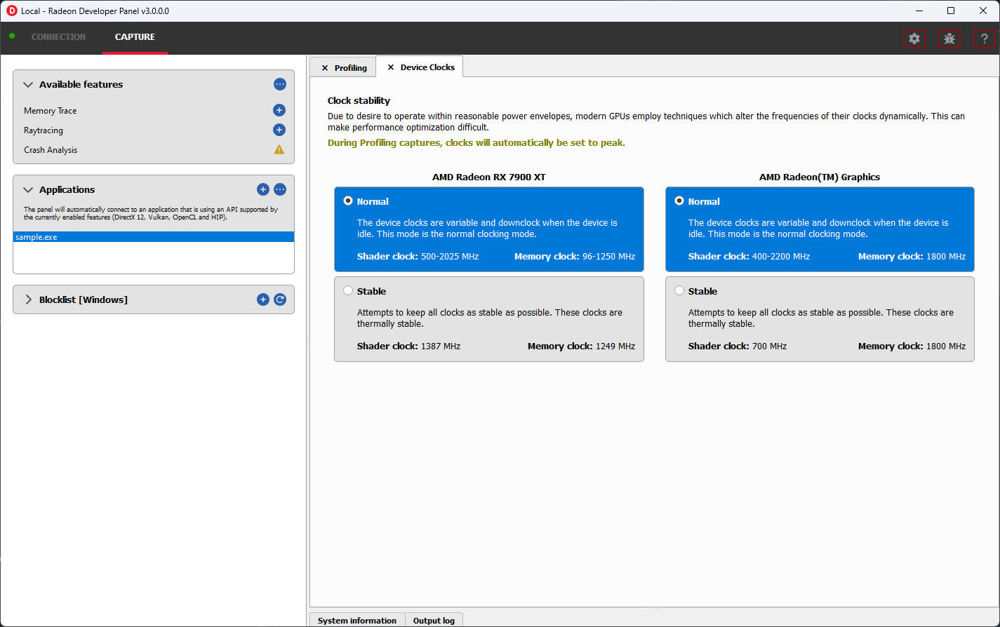

Features
========

Profiling
---------

This feature supports capturing a GPU profile for viewing in **Radeon GPU Profiler**.

.. image:: media/3.0/10_rgp_capture.png

The **Capture** section has the following items for profiling:

- **Capture target** - Selects the driver connection that should be profiled when a capture is triggered.

- **Capture profile** - Captures a profile and writes to disk.

- **Enable instruction tracing** - Enables capturing detailed instruction data.

- **Collect counters** - Enables capturing GPU cache counter data. Systems with an AMD Radeon RX 6000 or AMD Radeon RX 7000 series GPU will also collect raytracing counter data.

- **Delay capture** - If this is enabled, pressing the capture profile button or triggering the hotkey will first wait the entered number of milliseconds before capturing a profile.

.. NOTE:: Enabling capture of detailed instruction data may adversely affect performance.

The **Capture Settings** section has the following options for profiling:

- **SQTT Buffer Size**:
   * Defines the size of the buffer where SQTT data will be stored.
   * If a profile has missing data, the SQTT buffer size can be increased to potentially remedy the issue.
   * If an application experiences graphical corruption, decreasing the SQTT buffer size can potentially remedy the issue.

- **Enable shader instrumentation**
   * Enables support for capturing more detailed shader instrumentation data.

- **Auto capture**:
   * Displays configuration options for the trigger mode and dispatch range for profile capture.

   * **None** uses the default capture mode where clicking the **Capture profile** button will immediately
     capture the requested number of dispatches.

   * **Dispatch range** allows for setting the start and stop dispatch indices to use during automatic profile capture.

   * **Timer** allows for specifying the number of dispatches to capture after a specified elapsed time.

.. NOTE::
   To reduce the chance of truncated profile data, OpenCL profiling is limited to 10000 dispatches

Capturing a profile can be achieved by the following:

* **Click the Capture profile button**

   Clicking the **Capture profile** button from the Profiling UI will capture a frame and write the results to disk.

* **Use the Ctrl-Alt-C hotkey**

   Using Ctrl-Alt-C default hotkey on Windows or Linux® will capture a frame and write the results to disk.

   This can be configured **before launching an application** by clicking the edit button to the right of the hotkey label and then entering a series of key presses.

Example output:

   sample-20200908-092653.rgp

.. NOTE::
   Profiles will be output on disk at the path specified in the **Profiling output path** field shown below.

.. image:: media/3.0/21_recent_profiles.png

Memory Trace
------------

This feature enables capturing a memory trace for viewing in **Radeon Memory Visualizer**.

.. image:: media/3.0/22_memory_tracing.png

.. IMPORTANT::
   Memory tracing will have been implicitly started when the application was launched.

The **Capture** section has the following items for memory tracing:

-  **Capture target** - Selects the driver connection that should be dumped when the dump button is pressed.

-  **Dump trace** - Stops memory tracing for the selected capture target and writes results to disk.

-  **Insert snapshot** - insert user specified identifier to define snapshot in trace. A
   snapshot captures a moment in time in much the same way as a photograph. For example, to
   spot memory leaks, 2 snapshots can be added; one just before a game level is started after
   the menu screens and another snapshot when the game level finishes once the user is back in
   the game menus. Theoretically, the game should be in the same state in both cases (in the menus
   before and after a game level).

-  **Recently collected traces** - displays any recently collected traces in output directory

Writing out the memory trace to file can be achieved by one of the following:

* **Close the running application**

   When the client application terminates, the memory tracing
   will stop and the results will be written to disk.

* **Click the Dump trace button**

   Clicking the **Dump trace** button from the Memory Trace UI will stop
   memory tracing and write the results to disk.

Using either of the above methods to complete memory tracing
will result in a **Radeon Memory Visualizer** trace file being written to disk.

Example output:

   sample_20200316-143712.rmv

.. IMPORTANT::
      Once a memory trace has finished either through closing the application or
      through clicking the **Dump trace** button. The application **MUST** be
      closed and re-launched to start a new memory trace.

Raytracing
----------

This feature enables capturing a raytracing scene for viewing in **Radeon Raytracing Analyzer**.

.. image:: media/3.0/23_raytracing.png

The **Capture** section has the following items for raytracing:

- **Capture target** - Selects the driver connection that should have its raytracing scene captured when a capture is triggered.

- **Capture scene** - Captures a scene and writes to disk.

- **Delay capture** - If this is enabled, pressing the capture scene button or triggering the hotkey will first wait the entered number of milliseconds before capturing.

- **Collect ray dispatch data** - Captures detailed information about ray dispatches.

    .. NOTE::
        This feature is currently experimental on **Linux** and requires at least 16GB of system memory to work reliably in most cases.

- **Recently collected scenes** - Displays any recently collected scenes found in the output directory.

**Ray history** section allows for configuring settings for collecting ray dispatch data

- **Ray dispatch buffer size**:
   * Defines the buffer size in system memory used for allocating ray dispatch data during scene capture.

Capturing a scene can be achieved by the following:

* **Click the Capture scene button**

   Clicking the **Capture scene** button from the Raytracing UI will capture a raytracing scene and write the results to disk.

* **Use the Ctrl-F8 hotkey**

   Using Ctrl-F8 default hotkey on Windows or Linux® will capture a raytracing scene and write the results to disk.

   This can be configured **before launching an application** by clicking the edit button to the right of the hotkey label and then entering a series of key presses.

Example output:

   sample-20220705-104021.rra

Crash Analysis
--------------

This feature enables capturing a GPU crash summary using **Radeon GPU Detective**.

.. image:: media/3.0/24_crash_analysis.png

.. IMPORTANT::
    The following are requirements for crash analysis feature support

    **OS**: Windows® 10 or Windows® 11

    **GPU supported**: AMD Radeon RX 6000 or AMD Radeon RX 7000 series GPU

    **Minimum supported driver**: AMD Radeon Adrenalin Software Driver version 23.7.2

Before running an application to generate a crash dump, there are
a few settings that can be configured in the capture settings pane shown here:

- **Directory to store your dumps** - Path on disk where crash dumps are written out.

- **Automatic crash summary generation**

   For convenience, enabling these options will generate the respective crash dump summaries automatically upon capture.

- **Display execution marker source**

   If checked, each marker node in the generated summary file's
   execution marker tree will contain a tag specifying the source
   that generated the marker (such as Application, Driver, etc.).

- **Expand all execution marker nodes**

   If checked, all execution marker nodes in the marker tree will be expanded.

Once active, a GPU crash dump will be created once a TDR occurs.

Example output:

   sample-20230220-103954.rgd

Right clicking on a dump in the recently collected dumps pane will open a context menu with options to open the
generated crash summaries in the text editor specified in the Radeon Developer Panel settings. If a summary has not been
generated, an option will be present to first generate the summary using the Radeon GPU Detective CLI, then open
the summary. Deleting a dump from this context menu will also remove any summaries that have been generated.

.. image:: media/3.0/24_crash_analysis_context.png

.. NOTE::

    The Radeon GPU Detective executable path must be setup properly in the settings
    configuration to generate a crash summary.

Shown here is a sample crash dump summary:

.. image:: media/CrashDump_Output.png

Driver Experiments
------------------

Driver Experiments offer a way to change the behavior and performance characteristics of a game or other graphics
application without modifying its source code or configuration.
They control the low-level behavior of the graphics driver.
This tool exposes some of the driver settings that were
previously only available to AMD engineers who develop the driver, e.g. disabling
support for ray tracing or some optimizations in the shader compiler. Experiments are separate per graphics API
(DirectX 12, Vulkan). Both APIs offer a similar set of experiments, but not all experiments are available for every API.

Experiments may be used as the only feature in Radeon Developer Panel or together with other features.
For example, taking an RGP capture while experiments are activated will allow you to observe how the
experiments influenced the performance of some specific render passes and draw calls. Alternatively, you may
enable Crash Analysis feature and capture an RGD crash dump. Opening files captured with active driver experiments in
their respective tools will display a notification that the file was captured with some driver experiments applied, and
lists their values.

Activating driver experiments
^^^^^^^^^^^^^^^^^^^^^^^^^^^

After driver experiments are activated, the desired test application will need to connect to Radeon Developer Panel
to apply the experiments. Experiments are active only as long as Radeon Developer Panel is running.
Closing the Panel application or restarting the system reverts them to defaults.

The details pane will contain a description of the state of the selected experiment once an application connects.
A corresponding indicator will also be displayed in the experiments list to the left of experiments' name:

* Modified
    The user has provided an override for the experiment, but it has not yet been applied in a connected application.

    .. image:: media/3.0/35_driver_experiment_modified.png

* Applied
    The user override successfully applied and the driver behavior will be changed.

    .. image:: media/3.0/36_driver_experiment_applied.png

* Failed to apply
    The user override was not accepted by the driver and the driver's behavior will remain unchanged.

    .. image:: media/3.0/37_driver_experiment_failed_apply.png

* Unsupported
    The driver reported that this experiment was not currently supported. If a the experiment was set by the user, the value was not applied in the driver.

    .. image:: media/3.0/38_driver_experiment_unsupported.png

The user overrides of experiments can be saved to a JSON file using the Export button and
loaded later using the Import button.

Available driver experiments
^^^^^^^^^^^^^^^^^^^^^^^^^^^^

Features
********

Experiments in this group allow disabling support for some of the hardware features of modern AMD/Radeon GPUs,
which may be useful for debugging.

**Disable mesh shader support**

**Disable sampler feedback support**

**Disable raytracing support**

**Disable variable rate shading**

**Disable GPU work graphs support**

These experiments make it possible to disable support for some of the new GPU hardware features. When activated,
the graphics API exposes no support for the feature, like ``D3D12_FEATURE_DATA_D3D12_OPTIONS7::MeshShaderTier``,
or the equivalent Vulkan extension, like ``VK_EXT_mesh_shader``, as if the GPU doesn’t have the support.

Applications that don’t require the feature typically then fall back to some other implementation, e.g. using
vertex shaders instead of mesh shaders or using screen-space reflections instead of ray-traced reflections. If
there is a bug in the application code that uses the feature, which makes it crash or return incorrect results,
disabling the feature allows testing without the feature enabled. For example, if an application is crashing and
activating the "Disable raytracing support" experiment alleviates the crash,
it can be surmised that the raytracing code is causing the crashes.

**Disable low precision support**

Disables support for 16-bit floating point numbers (half-floats) in shaders when used as minimum precision numbers.
Minimum precision numbers in HLSL, like the ``min16float`` type, allow declaring variables where 16-bit precision is
sufficient. If half-floats are not supported in some operation or if it would yield better performance, the shader
compiler will use a full 32-bit (single precision) float. With this experiment activated,
minimum precision numbers (``D3D12_FEATURE_DATA_D3D12_OPTIONS::MinPrecisionSupport``) are not supported and such
numbers in shaders fall back to using the full 32-bit precision.

Using half-floats in shaders can improve performance in some cases due to faster calculations and smaller storage
requirements, but it can also be a source of bugs. A 16-bit floating-point number retains only around 3 decimal digits
of precision, can represent integer numbers exactly only up to 2048. Additionally, 16-bit floating points have a maximum
value of 65504, above which they become infinity. This may be enough for calculations on HDR colors or normal vectors,
but it is not sufficient to operate on vertex positions and many other types of data. It is very easy for intermediate
calculations to exceed the maximum value, e.g. in dot product of two vectors. If activating this
experiment fixes the problem of seeing incorrect results of the calculations in shaders, NaN or INF values, then
likely the shader should be modified to use full precision (``float``). It may also indicate a bug in the shader
compiler, although less likely.

**Disable native 16-bit type support**

This experiment disables support for explicit 16-bit data types in shaders
(``D3D12_FEATURE_DATA_D3D12_OPTIONS4::Native16BitShaderOpsSupported``) available in Shader Model 6.2, like the
type ``float16_t``. When the experiment is activated, applications cannot use shaders that utilize native 16-bit types,
and they should fall back to some implementation that use full precision numbers. If activating this experiment fixes a
bug, it may indicate the is a bug in the 16-bit version of the shader. Possibly, the precision or range of 16-bit numbers is
insufficient for some calculations. It may also indicate a bug in the shader compiler, although less likely.

**Disable AMD vendor extensions**

Activating this experiment disables support for custom AMD extensions to the graphics APIs. In DirectX 12 it means
extensions available through AMD GPU Services (AGS) library (``AGSDX12ReturnedParams::ExtensionsSupported``) are
returned as unsupported. In Vulkan, it means VK\_AMD\_ and VK\_AMDX\_-prefixed device extensions are not available.

If an application makes use of such custom vendor extensions, this experiment can help with debugging. When the bug is
fixed after activating this experiment, it indicates that the problem may be in the incorrect use of one of these
extensions.

**Disable compute queue support**

When this experiment is activated, the Vulkan implementation does not expose compute-only queues. It will be as if
the GPU did not support asynchronous compute queues; for the queue family with ``QUEUE_COMPUTE_BIT``
but not ``QUEUE_GRAPHICS_BIT`` set ``queueCount`` will be zero. Vulkan applications should typically
be prepared for that and fall back to an implementation that executes its workload on the graphics queue only.

In DirectX 12 there is no way to expose the lack of support for asynchronous compute queue. When the experiment is
activated, the GPU executes all commands submitted to compute queues on the graphics queue, serialized with the graphics
workload.

This experiment can be used for debugging problems with asynchronous compute. If activating it fixes the bug, it may
indicate a problem with synchronization or accessing resources shared between the 3D workload (draw calls) executed
on the graphics queue and compute dispatches intended to run in parallel in the compute queue.

**Disable copy queue support**

Activating this experiment for DirectX 12 makes all copy commands submitted to the copy queue execute
on the graphics queue instead, which can help in debugging synchronization issues with workloads intended
to run in parallel on multiple queues.

Optimizations
*************

Experiments in this group modify shader compiler and general driver behavior that improves performance.
While optimizations should not change the logic, in some cases disabling them may help in debugging various types
of issues.

**Disable floating-point optimizations**

When activated, the compiler skips some of the optimizations typically done on the shader code related to calculations
on floating-point numbers, like fusing MUL + ADD instructions into an FMA instruction. While in general optimizations
should not change the compiler logic, they can change the precision of some operations, so the numerical results would
not be bit-exact to the least significant bits with the unoptimized version.
If activating this experiment fixes a bug (e.g., a discrepancy between numerical results of a position-only versus full
vertex shader), it may indicate that the application relies too much on the precision of the calculations. Changing some
expressions in the shader code may help. It may also indicate a bug in the shader compiler, although less likely.

**Disable shader compiler optimizations**

When active, the experiment disables shader compiler optimizations which may result in non-optimal shader code.
This may cause shaders to take longer to run.

If enabling this experiment fixes a bug, it may indicate the bug is related to timing of individual draw calls.
This may be a problem with synchronization, such as a missing barrier. It may also indicate a bug in the shader
compiler.

**Disable barrier optimizations**

This experiment disables some optimizations made by the driver at the level of synchronization and barriers between draw
calls. By default, the driver optimizes command execution as much as possible by inserting fine-grained barriers to
ensure correctness and maximum performance at the same time. For example, a pixel shader may need to wait for the pixel
shader of the previous draw call to finish, but the vertex shader of that draw call can start executing earlier. This
experiment disables some of these optimizations, which may decrease performance. If activating this experiment fixes a
bug, it may indicate a bug in synchronization, like a missing or incorrect barrier.

**Disable acceleration structure optimizations**

This experiment disables some of the optimizations made by the driver when building ray tracing acceleration structures,
which may increase their size in memory and decrease the traversal performance in ray tracing. It should not change the
logic.

If activating this experiment fixes a bug, it can indicate that the application incorrectly handles synchronization
between ray tracing dispatches (e.g. a missing or incorrect barrier). It could also indicate that the application
doesn't correctly handle the increased size required for the acceleration structures or the scratch buffers needed
to build them. It may also indicate a bug in the driver, although less likely.

**Vertex/hull/… shader wave size**

AMD RDNA architecture supports 32 or 64 threads per wave. During the compilation of every shader, the shader compiler
will use a heuristic to determine whether to use 32 or 64 threads per wave, with the goal of reaching maximum
performance. This experiment allows enforcing a specific mode of shader compilation for a specific
shader stage (e.g. vertex or pixel shaders) whenever possible. This should not change the logic, but it can impact
performance.

If a shader uses explicit wave functions (called subgroup functions in Vulkan), like ``WaveReadLaneFirst``, and toggling
this experiment fixes a bug, it can indicate the shader relies on a specific wave size to work correctly, which should
not be the case. It may also indicate a bug in the shader compiler, although less likely.

The experiment may also be used to compare the performance of a draw call executing the same shader with different wave
sizes. If profiling (e.g. using RGP) shows that the wave size selected by the driver is not optimal for a specific
shader, you can use ``[WaveSize()]`` attribute from Shader Model 6.6 to prepare an optimized version of the shader
with and explicit wave size to be used when possible.

.. NOTE::
    In certain situations, this experiment has no impact for some shaders due to driver overrides.
    You can use a runtime tool (such as Radeon GPU Profiler) to confirm that this experiment has been
    activated with the hardware.

**Disable raytracing shader inlining**

DXR shaders on AMD GPUs can be compiled in one of two modes. It can be observed in tools like RGP or RRA as:

* \<Indirect\>
    individual ray generation, closest hit, any hit, miss shaders etc. stay separate, get called and
    returned from.
* \<Unified\>
    all shaders participating in the ray tracing pipeline are inlined together, which may increase the
    time it takes to compile the pipeline state object but may improve the performance when executing this shader.

The decision is made by the shader compiler based on some heuristics with the goal of reaching maximum performance.
It should not change the logic. This experiment forces the compiler to always choose the Indirect mode. If activating this
experiment shortens the time it takes for a game to launch and load while it creates Pipeline State Objects (PSOs), it
indicates that the creation of ray tracing PSOs takes significant amount of this time. For the fastest loading times,
PSO creation should be done in multiple background threads, and a pipeline library should be used to cache them.
If activating this experiment fixes a bug: a CPU crash or hang on PSO creation, GPU crash on shader execution,
or incorrect results returned, it indicates a bug in the shader compiler.

**Disable shader cache**

Shader compilation happens in two stages. First, high level shader language (HLSL or GLSL) is compiled to an
intermediate representation independent of the GPU and defined by the graphics API
(DXIL in DirectX 12, SPIR-V in Vulkan). This should happen offline when the application is prepared to release to end
users. The second stage happens in the graphics driver when a pipeline state object is created. The intermediate
representation is then compiled to the assembly (ISA) appropriate for the specific GPU. This typically happens at
runtime (e.g. when a game is launched or loads a level) and can take significant time. To optimize this process,
compiled shaders are cached at multiple levels. Developers are encouraged to use a pipeline library available in the
D3D12 API, but the driver also caches compiled shaders at the low level.

This experiment disables the shader cache implemented by the driver. It should not change the logic, but it can impact
the duration of PSO creation. If activating this experiment makes the application launch and load much longer, it can
indicate the creation of the application PSOs take significant time that is optimized thanks to the cache, but new users
would experience it the first time they launch the application. Activating this experiment will make PSO
behave like it would on a system that has never run the application before. This can provide a more reliable measurement
of the application startup time with a cold shader cache.

Safety features
***************

Experiments in this group generally offer extra safety features that can decrease performance, but can make the
application more correct and stable. Activating safety features can help expose errors in the code that
could potentially cause instability in an application.

**Disable depth-stencil texture compression**

This experiment disables internal compression of depth-stencil textures. If activating it fixes a bug related to
incorrect rendering, it can indicate that there is missing or incorrect initialization of a depth-stencil texture.

.. NOTE::
    On RDNA 2 cards (AMD Radeon RX 6000 series), in certain situations, this experiment has no impact for some textures
    due to driver overrides. You can use a runtime tool (such as Radeon GPU Profiler) to confirm that this experiment
    has been activated with the hardware.

**Zero unbound descriptors**

This experiment initializes unbound descriptors with zeros. If enabling it fixes a bug, it can indicate that the
application may be accessing an unbound descriptor table.

**Thread-safe command buffer allocator**

Command buffer allocator objects are not thread-safe and should only be accessed from one thread at a time. When an
application uses parallel recording of command buffers or multiple threads, it typically uses a separate command
allocator per thread.

This experiment makes command allocators thread-safe, synchronized internally. If activating it fixes a bug, it can
indicate the bug is related to synchronization between threads that use command allocators and command buffers for
rendering.

**Force structured buffers as raw**

A structured buffer defines a stride, which is the number of bytes needed for a single instance of the structure,
or a step to take with a pointer to move to the next structure instance. This parameter is passed when creating a
Shader Resource View (SRV) descriptor for a structured buffer, but the structure of specific size is also declared
in the shader code for that structured buffer to be bound to the specific shader resource slot. These two should match.
If they do not match, the result is undefined and may differ between different GPUs.

This experiment forces the GPU to use the stride from the shader instead of the descriptor. If activating it fixes a
bug, it may indicate the bug is caused by incorrect declaration of the structured buffer in the application code or in the
shader code. It could also indicate that a raw buffer is being accidentally used instead of a structured buffer.

**Vertical synchronization**

Vertical synchronization (V-sync) is a setting commonly offered by games to control the behavior of presenting
frames on the screen.

**When off**, frames are presented as soon as they are ready (when rendering is finished). It typically increases the
number of frames per second (FPS), makes the GPU busier, up to 100% (if the game is not bound by its CPU workload),
but it can expose an unpleasant visual effect on the screen known as tearing. This mode is good for testing the system
and the game under maximum load, and for performance measurements.

**When on**, new frames are presented only when the monitor is ready to present them. FPS is then limited to the refresh
rate of the monitor (60 Hz on typical monitors), GPU load is lower, battery usage is lower, as the game is blocked and
waits until a subsequent frame can be rendered and presented. This eliminates the tearing effect and so this mode is good
for normal gaming.

V-sync is typically controlled by the application. This experiment allows to override it and force it to be on or off.
This allows performing tests with various purposes on applications that don’t offer control over V-sync. For example,
if forcing it on fixes a bug, it may indicate the bug is sensitive to the timing of draw calls and render passes,
which may be caused by incorrect CPU-GPU synchronization of render frames, command buffer submission, present call, etc.
If forcing V-sync on fixes a problem with the whole system crashing or shutting down, it may indicate a problem with
GPU or CPU overheating.

Device Clocks
-------------

The Radeon Developer Panel (RDP) allows the developer to select from a
number of clock modes.

Normal clock mode will run the GPU as it would normally run your
application. To ensure that the GPU runs within its designed power and
temperature envelopes, it dynamically adjusts the internal clock frequency.
This means that profiles taken of the same application may differ
significantly, making side-by-side comparisons impossible.

Stable clock mode will run the GPU at a lower, fixed clock rate. Even though
the application may run slower than normal, it will be much easier to compare
profiles of the same application.

.. NOTE::

    When capturing an RGP profile, clock modes for the device will be changed to peak during capture.
