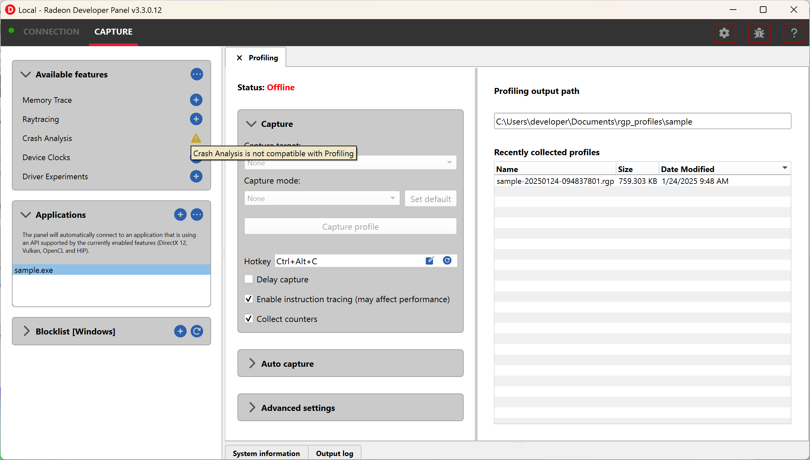
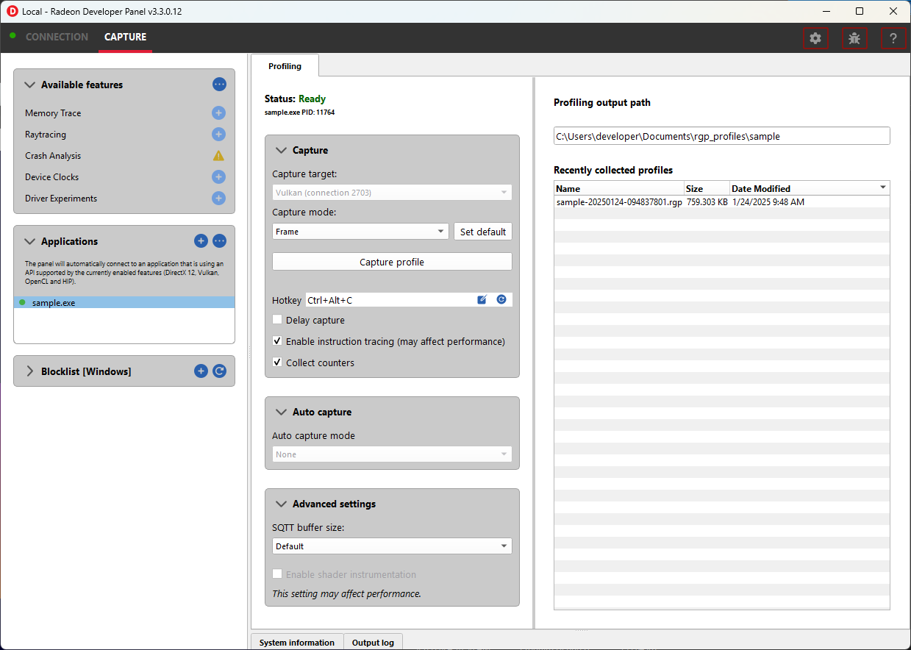

Radeon™ Developer Panel
==========================

The Radeon Developer Panel is part of a suite of tools that can be used
by developers to optimize DirectX® 12, Vulkan®, OpenCL™ and HIP applications for AMD RDNA™
hardware. The suite is comprised of the following software:

-  **Radeon Developer Mode Driver** – This is shipped as part of the AMD
   public driver and supports the developer mode features
   required for profiling and debugging.

-  **Radeon Developer Service (RDS)** – A system tray application that
   unlocks the Developer Mode Driver features and supports
   communications with high level tools.

-  **Radeon Developer Service - CLI (Headless RDS)** – A console (i.e.
   non-GUI) application that unlocks the Developer Mode Driver features
   and supports communication with high level tools.

-  **Radeon Developer Panel (RDP)** – A GUI application that allows the
   developer to configure driver settings and generate profiles from
   DirectX12, Vulkan, OpenCL and HIP applications.

-  **Radeon GPU Profiler (RGP)** – A GUI tool used to visualize and
   analyze the profile data.

-  **Radeon GPU Detective (RGD)** - A command line tool that assists developers in post-mortem analysis of GPU crashes.

-  **Radeon Memory Visualizer (RMV)** - A GUI tool used to visualize and analyze
   the memory trace data.

-  **Radeon Raytracing Analyzer (RRA)** - A GUI tool used to visualize and analyze
   the raytracing data.

   This document describes how the Radeon Developer Panel can be used to capture
   a profile, memory trace or a raytracing scene for an application on AMD RDNA graphics hardware. The
   Radeon Developer Panel connects to the Radeon Developer Service in
   order to collect a profile, trace or scene.

   **RGP documentation:** https://radeon-gpuprofiler.readthedocs.io/en/latest/

   **RMV documentation:** https://radeon-memory-visualizer.readthedocs.io/en/latest/

   **RRA documentation:** https://radeon-raytracing-analyzer.readthedocs.io/en/latest/

   **RGD documentation:** https://radeon-gpu-detective.readthedocs.io/en/latest

.. NOTE::
   By default, the driver allocates a maximum of 75 MB video
   memory per Shader Engine to capture RGP profiles. The driver allocates
   300 MB video memory for the single shader engine with instruction tracing enabled.
   This can be configured in the capture settings.

Graphics APIs, RDNA hardware, and operating systems
---------------------------------------------------------------------

**Supported APIs**

-  DirectX12

-  Vulkan

\ **Supported RDNA hardware**

-  AMD Radeon RX 7000 series

-  AMD Radeon RX 6000 series

-  AMD Radeon RX 5000 series

-  AMD Ryzen™ Processors with Radeon Graphics

\ **Supported Operating Systems**

-  Windows® 10

-  Windows® 11

-  Ubuntu 22.04 LTS (Vulkan only)

Compute APIs, RDNA hardware, and operating systems
--------------------------------------------------------------------

**Supported APIs**

-  OpenCL

-  HIP

\ **Supported RDNA hardware**

-  AMD Radeon RX 7000 series

-  AMD Radeon RX 6000 series

-  AMD Radeon RX 5000 series

-  AMD Ryzen Processors with Radeon Graphics

\ **Supported Operating Systems**

-  Windows® 10

-  Windows® 11

Initial setup
=============

.. IMPORTANT::
      The application you want to profile, trace or capture scenes from must **NOT** already be
      running. The panel needs to be configured in advance of starting your
      application.

1) Start the **RadeonDeveloperPanel(.exe)** on your local system. The
   panel will startup up with the Connection tab already highlighted
   (see below).

.. image:: media/3.0/0_connection_page.png
..

   The connection panel has three main elements:

-  **Connection status** – to the Radeon Developer Service (currently
   not connected)

-  **Connection dropdown** - choose a previous connection to connect to. **Local** will always
   be available in this list

-  **New connection** – section that allows you specify a new remote connection. New connections
   will be added to the connections list

2) Connect to a **Local** or **Remote** connection:

      Select an entry from the Connection dropdown,
      then click the “Connect” button. This will attempt to establish a connection to a **Radeon Developer Service**

Note that the red indicator to the left of the “CONNECTION” tab will change to
green to indicate that the connection was successful.

Connections to applications will timeout after a brief period of no API calls being made. For example, a timeout will likely occur when a 
connected application is suspended by a debug breakpoint or if the application is only occasionally refreshing.
Enabling the "Disable client timeout" toggle will stop Radeon Developer Panel disconnecting from inactive clients.

.. NOTE::
   For Local connections, starting **Radeon Developer Service** is optional.
   For Remote Connections, a **Radeon Developer Service** instance must be started on the remote machine (see below)

Remote connections
==================

1) Start the **RadeonDeveloperService(.exe)** on the **remote** system (the machine
where the application is to be run). Make a note of the remote system's IP address
(open a command prompt and type 'ipconfig').

2) Start the **RadeonDeveloperPanel(.exe)** on the local system. On the **CONNECTION**
tab, enter the IP address of the **remote** system in the **Host name** and then
click the  “Connect” button.

Optionally a nickname for the connection can be provided. This name will show in parentheses in the Connection dropdown.

.. image:: media/3.0/1_connection_remote_ip.png

Capture
======

After a connection is made to the service, the panel will switch to the
**Capture** tab.

.. image:: media/3.0/2_capture_tab_landing.png

The capture tab is structured as follows:

- :ref:`AvailableFeatures` - List of supported features for the active connection that can be enabled.

- :ref:`Applications` - List of actively or previously connected applications.

- :ref:`BlockedApplications` - List of applications blocked from connecting to the panel.

- :ref:`SystemInformation` - Lists detailed hardware and system information for the active local or remote connection.

- :ref:`OutputLog` - Displays log messages generated by the panel.

.. _AvailableFeatures:

Available features
------------------

The **Available features** section lists the available features for the current **Local** or **Remote** connection that can be enabled. Features in
this list can be enabled by clicking plus button next to the feature name.

.. NOTE::
    In some scenarios, features may not be available for enablement due
    to conflicts with other already enabled features as shown here:

Presets
-------

Provides a set of enabled features and associated feature settings to create common capture workflows.

.. IMPORTANT::
    Changes to the enabled features and feature settings of a preset must be explicitly saved as shown below

.. image:: media/3.0/30_custom_preset_saving.png

.. _Applications:

Applications
------------

The **Applications** pane in Radeon Developer Panel contains the list of applications that have connected previously or
are currently connected to the panel.

Applications can connect to the panel under two auto connection modes:

   - **Any application** - Any application run that matches the selected API filter and is not contained in the blocklist will connect. Applications that are not already present in the application list will be added.

   - **Existing applications** - Only applications with entries specified in the application list that match the selected API filter will connect.

.. IMPORTANT::
    For using the **Existing applications** auto connect mode, applications can be added to the list using explicitly using
    the add button in the **Applications** pane.

Connections may also be filtered by a specific API such as **DirectX 12**, **Vulkan**, **OpenCL**, etc.

These modes can be configured by selecting the icon in the top right of the pane which will display the following dialog:

.. image:: media/3.0/18_application_filters.png

.. IMPORTANT::
      The **API** specified works as a filter against the client application
      accepting the driver connection. If you are unsure of what **API** is being used
      or don't care use the default **Any supported**

Once an application is added to the list, it can then be run on the system to
start a driver connection.

.. _BlockedApplications:

Blocked applications
-------------------------

Sometimes it is useful to completely exclude certain background applications
from being recognized and displayed in the Radeon Developer Panel. For example,
Windows 10 has applications that use DirectX 12 and when they are started can
show up in the list of target applications. The **Profiling** feature also requires
that only one application is started while using the feature so blocking applications, such as launchers
that run before another application starts, can be useful.

The panel maintains a list of default applications that are blocked on either Windows or Linux.
This list can be viewed from the **Blocklist** pane
which will populate once a local or remote connection has been established.
Applications can be added or removed from the list by clicking one of the buttons below the list
of process names. When editing or removing entries, first select the process name
from the list then click the edit or remove button. The list can also be restored
to the default set of blocked applications. Right clicking on a process name in the
list will display context menu options to add, remove, or edit.

The blocked applications list supports wildcard matching. The following syntax is supported:
    * ? : Matches exactly one of any character
    * [...] : Matches one character in a set of characters
    * \* : Matches zero or more of any character

These can be escaped by using backslash.

Here are some examples of blocked application items that leverage the wildcard matching:
    * [Gg]ears.exe : Blocks any application called gears.exe with either a lowercase or uppercase G
    * gpu_info\* : Blocks any applications who's name starts with gpu_info
    * test?.exe : Blocks any application called test with a single character suffix -- e.g. test1 or test6

.. _SystemInformation:

System information
------------------

The system information pane lists detailed hardware and system information for the active Radeon Developer Panel connection. 

Pressing the Export button will open a dialog to choose a folder. Upon selecting a folder, the system information will be exported to that folder
as a JSON file.

.. _OutputLog:

Output log
----------

Logging information about the connection and any errors encountered by Radeon Developer Panel or the Radeon Developer Service is
displayed here. The output log can be filtered by the source that produced the message or the process id that that message was relevant for.

.. image:: media/3.0/28_output_log.png

Selecting the **Open log file location** button will open the directory containing the log file.

| On Windows, this log is located at:
| "C:\\Users\\your_name\\AppData\\Roaming\\RadeonDeveloperPanel\\log.txt"

| On Linux, this log is located at:
| "~/.local/share/RadeonDeveloperPanel/log.txt"

Features
========

Profiling
---------

This feature supports capturing a GPU profile for viewing in **Radeon GPU Profiler**.

The **Capture** section has the following items for profiling:

- **Capture target** - Selects the driver connection that should be profiled when a capture is triggered.

- **Capture profile** - Captures a profile and writes to disk.

- **Enable instruction tracing** - Enables capturing detailed instruction data.

- **Collect counters** - Enables capturing GPU cache counter data. Systems with an AMD Radeon RX 6000 or AMD Radeon RX 7000 series GPU will also collect raytracing counter data.

- **Delay capture** - If this is enabled, pressing the capture profile button or triggering the hotkey will first wait the entered number of milliseconds before capturing a profile.

.. NOTE:: Enabling capture of detailed instruction data may adversely affect performance.

The **Capture Settings** section has the following options for profiling:

- **SQTT Buffer Size**:
   * Defines the size of the buffer where SQTT data will be stored.
   * If a profile has missing data, the SQTT buffer size can be increased to potentially remedy the issue.
   * If an application experiences graphical corruption, decreasing the SQTT buffer size can potentially remedy the issue.

- **Enable shader instrumentation**
   * Enables support for capturing more detailed shader instrumentation data.

- **Auto capture**:
   * Displays configuration options for the trigger mode and dispatch range for profile capture.

   * **None** uses the default capture mode where clicking the **Capture profile** button will immediately
     capture the requested number of dispatches.

   * **Dispatch range** allows for setting the start and stop dispatch indices to use during automatic profile capture.

   * **Timer** allows for specifying the number of dispatches to capture after a specified elapsed time.

.. NOTE::
   To reduce the chance of truncated profile data, OpenCL profiling is limited to 10000 dispatches

Capturing a profile can be achieved by the following:

* **Click the Capture profile button**

   Clicking the **Capture profile** button from the Profiling UI will capture a frame and write the results to disk.

* **Use the Ctrl-Alt-C hotkey**

   Using Ctrl-Alt-C default hotkey on Windows or Linux® will capture a frame and write the results to disk.

   This can be configured **before launching an application** by clicking the edit button to the right of the hotkey label and then entering a series of key presses.

Example output:

   sample-20200908-092653.rgp

.. NOTE::
   Profiles will be output on disk at the path specified in the **Profiling output path** field shown below.

.. image:: media/3.0/21_recent_profiles.png

Memory Trace
------------------------------------

This feature enables capturing a memory trace for viewing in **Radeon Memory Visualizer**.

.. image:: media/3.0/22_memory_tracing.png

.. IMPORTANT::
   Memory tracing will have been implicitly started when the application was launched.

The **Capture** section has the following items for memory tracing:

-  **Capture target** - Selects the driver connection that should be dumped when the dump button is pressed.

-  **Dump trace** – Stops memory tracing for the selected capture target and writes results to disk.

-  **Insert snapshot** - insert user specified identifier to define snapshot in trace. A
   snapshot captures a moment in time in much the same way as a photograph. For example, to
   spot memory leaks, 2 snapshots can be added; one just before a game level is started after
   the menu screens and another snapshot when the game level finishes once the user is back in
   the game menus. Theoretically, the game should be in the same state in both cases (in the menus
   before and after a game level).

-  **Recently collected traces** – displays any recently collected traces in output directory

Writing out the memory trace to file can be achieved by one of the following:

* **Close the running application**

   When the client application terminates, the memory tracing
   will stop and the results will be written to disk.

* **Click the Dump trace button**

   Clicking the **Dump trace** button from the Memory Trace UI will stop
   memory tracing and write the results to disk.

Using either of the above methods to complete memory tracing
will result in a **Radeon Memory Visualizer** trace file being written to disk.

Example output:

   sample_20200316-143712.rmv

.. IMPORTANT::
      Once a memory trace has finished either through closing the application or
      through clicking the **Dump trace** button. The application **MUST** be
      closed and re-launched to start a new memory trace.

Raytracing
-------------------------------------------------------

This feature enables capturing a raytracing scene for viewing in **Radeon Raytracing Analyzer**.

The **Capture** section has the following items for raytracing:

- **Capture target** - Selects the driver connection that should have its raytracing scene captured when a capture is triggered.

- **Capture scene** - Captures a scene and writes to disk.

- **Delay capture** - If this is enabled, pressing the capture scene button or triggering the hotkey will first wait the entered number of milliseconds before capturing.

- **Collect ray dispatch data** - Captures detailed information about ray dispatches.

    .. NOTE::
        This feature is currently experimental on **Linux** and requires at least 16GB of system memory to work reliably in most cases.

- **Recently collected scenes** - Displays any recently collected scenes found in the output directory.

**Ray history** section allows for configuring settings for collecting ray dispatch data

- **Ray dispatch buffer size**:
   * Defines the buffer size in system memory used for allocating ray dispatch data during scene capture.

Capturing a scene can be achieved by the following:

* **Click the Capture scene button**

   Clicking the **Capture scene** button from the Raytracing UI will capture a raytracing scene and write the results to disk.

* **Use the Ctrl-F8 hotkey**

   Using Ctrl-F8 default hotkey on Windows or Linux® will capture a raytracing scene and write the results to disk.

   This can be configured **before launching an application** by clicking the edit button to the right of the hotkey label and then entering a series of key presses.

Example output:

   sample-20220705-104021.rra

Crash Analysis
-----------------------------------------------------

This feature enables capturing a GPU crash summary using **Radeon GPU Detective**.

.. image:: media/3.0/24_crash_analysis.png

.. IMPORTANT::
    The following are requirements for crash analysis feature support

    **OS**: Windows® 10 or Windows® 11

    **GPU supported**: AMD Radeon RX 6000 or AMD Radeon RX 7000 series GPU

    **Minimum supported driver**: AMD Radeon Adrenalin Software Driver version 23.7.2

Before running an application to generate a crash dump, there are
a few settings that can be configured in the capture settings pane shown here:

- **Directory to store your dumps** - Path on disk where crash dumps are written out.

- **Automatic crash summary generation**

   For convenience, enabling these options will generate the respective crash dump summaries automatically upon capture.

- **Display execution marker source**

   If checked, each marker node in the generated summary file's
   execution marker tree will contain a tag specifying the source
   that generated the marker (such as Application, Driver, etc.).

- **Expand all execution marker nodes**

   If checked, all execution marker nodes in the marker tree will be expanded.

Once active, a GPU crash dump will be created once a TDR occurs.

Example output:

   sample-20230220-103954.rgd

Right clicking on a dump in the recently collected dumps pane will open a context menu with options to open the
generated crash summaries in the text editor specified in the Radeon Developer Panel settings. If a summary has not been
generated, an option will be present to first generate the summary using the Radeon GPU Detective CLI, then open
the summary. Deleting a dump from this context menu will also remove any summaries that have been generated.

.. image:: media/3.0/24_crash_analysis_context.png

.. NOTE::

    The Radeon GPU Detective executable path must be setup properly in the settings
    configuration to generate a crash summary.

Shown here is a sample crash dump summary:

.. image:: media/CrashDump_Output.png

Device Clocks
--------------------------------

The Radeon Developer Panel (RDP) allows the developer to select from a
number of clock modes.

.. image:: media/3.0/17_device_clocks.png

Normal clock mode will run the GPU as it would normally run your
application. To ensure that the GPU runs within its designed power and
temperature envelopes, it dynamically adjusts the internal clock frequency.
This means that profiles taken of the same application may differ
significantly, making side-by-side comparisons impossible.

Stable clock mode will run the GPU at a lower, fixed clock rate. Even though
the application may run slower than normal, it will be much easier to compare
profiles of the same application.

.. NOTE::

    When capturing an RGP profile, clock modes for the device will be changed to peak during capture.

Settings
========

At any time the Radeon Developer Panel settings can be accessed by clicking the gear button in the upper right corner. This will open the
settings pane.

After capturing a profile, trace or scene from an application, it is often desirable to open the output
file using the associated tool such as **Radeon GPU Profiler**, **Radeon Memory Visualizer**, **Radeon Raytracing Analyzer**, or **Radeon GPU Detective**.

The settings pane allows for choosing the global path to the tool to be used by Radeon Developer Panel to open
captured profiles, traces and scenes. For convenience, using the **Locate Radeon Developer Tool Suite** button will allow for selection
of a downloaded Radeon Developer Tool Suite package and automatically configure all paths.

Additionally, the settings pane contains the **Auto open traces** toggle which will cause Radeon Developer Panel to open a captured
profile, trace or scene with the correct tool as soon as it is captured.

A **Restore Defaults** button allows for resetting the path and auto open settings to their default values. For the paths, this
will reset them to the panel's executable path directory.

.. image:: media/3.0/25_settings.png

Bug Report
==========

At any time, a bug report template can be generated by clicking the bug button in the upper right corner. This will copy a template to your clipboard with relevant information such as the graphics cards and operating system of the connected system.

When reporting bugs, please use the generated template and fill in the description and proper steps to reproduce the issue marked by the **"(fill me in)"** sections.

The Radeon Developer Service
============================

Two versions of the Radeon developer service are provided, one with a
configuration UI and system tray icon, and one designed for use with
headless GPU system where no UI can be supported.

Radeon Developer Service for desktop developer system
-----------------------------------------------------

RadeonDeveloperService(.exe) – Can be used for general use where the
system has a monitor and UI (e.g. desktop development machines). The
Radeon Developer Service includes a configuration window containing
basic service configuration settings and software info. **Double click
the Radeon Developer Service system tray icon** to open the
configuration window, or right-click on the system tray icon and select
‘configure’ from the context menu.

.. image:: media/3.0/26_service_configuration.png

-  **Listen port** – The port that the Radeon Developer Service uses to
   listen for incoming connections from a remote Radeon Developer Panel.
   **The default port is 27300**. Altering the port will disconnect all
   existing sessions. The circular arrows icon to the right of the
   Listen port field can be clicked to reset the port to the default
   value.

-  **Version info** – Software version information for the Radeon
   Developer Service.

Double click the Radeon Developer Service system tray icon again or
right-click on the system tray icon and select ‘configure’ from the
context menu to close the configuration window.

.. IMPORTANT::
    When running both the Radeon Developer Panel and
    the Radeon Developer Service on the same system the communication
    between the two uses pipes, not sockets and ports, so setting the port
    has no effect.

Radeon Developer Service for headless GPU systems
-------------------------------------------------

RadeonDeveloperServiceCLI(.exe) – Command line version for use with
headless GPU systems where no UI can be provided. This version can
also run on a system that has a monitor and UI.

The following command line options are available for
RadeonDeveloperServiceCLI:

1) **-- port <port number>** *Overrides the default listener port used
   by the service (27300 is the default).*

.. NOTE::
    The service will need to be explicitly started
    before starting the Radeon Developer Panel. If the service isn’t
    running, the Radeon Developer Panel will automatically start the UI
    version of the Radeon Developer Service, which may not be what is
    required.

Known Issues
============

Cleanup After a RadeonDeveloperServiceCLI Crash
-----------------------------------------------

If the RadeonDeveloperServiceCLI executable crashes on Linux, shared
memory may need to be cleaned up by running the remove_shared_memory.sh
script located in the script folder of the RGP release kit. Run the
script with elevated privileges using sudo. If this fails to work,
try starting the panel with elevated privileges.

Windows Firewall Blocking Incoming Connections
----------------------------------------------

1) **Deleting the settings file**. If problems arise with connection or
   application histories, these can be resolved by deleting the Radeon
   Developer Panel’s settings file at:
   "C:\\Users\\your\_name\\AppData\\Roaming\\RadeonDeveloperPanel\\settings.ini"

   on Windows. On Linux, the corresponding file is located at:

   "~/.local/share/RadeonDeveloperPanel/settings.ini"

2) **“Connection Failure”** error message. This issue is sometimes seen
   when running the panel for the very first time. The panel tries to
   start the service automatically for local connections and this can
   fail. If you see this message try manually starting the
   “RadeonDeveloperService(.exe)” and connect again.

3) **Remote connection attempts timing out.** When running the Radeon
   Developer Service on Windows, the Windows Firewall may attempt to
   block incoming connection attempts from other machines. The best
   methods of ensuring that remote connections are established correctly
   are:

   a. Allow the RDS firewall exception to be created within the Windows
      Firewall when RDS is first started. Within the Windows Security
      Alert popup, enable the checkboxes that apply for your network
      configuration, and click “Allow access”.

a. If “Cancel” was previously clicked in the above step during the first
   run, the exception for RDS can still be enabled by allowing it within
   the Windows Control Panel firewall settings. Navigate to the “Allow
   an app or feature” section, and ensure that the checkbox next to the
   RadeonDeveloperService(.exe) entry is checked:

.. image:: media/Firewall_2.png

.. image:: media/Firewall_3.png

a. Alternatively, disable the Windows Firewall entirely will also allow
   RDS to be connected to.

.. NOTE::
   The Windows firewall alert in no way indicates that the Radeon
   Developer tools are trying to communicate to an AMD server over the
   internet. The Radeon Developer tools do not attempt to connect to a remote
   AMD server of any description and do not send personal or system information
   over remote connections. The Radeon Developer Panel needs to communicate
   with the Radeon Developer Service, which may or may not be on the same
   machine, and a connection needs to be made between the two (normally via a
   socket).

Disabling Linux Firewall
------------------------

If the remote machine is running Linux and the **“Connection Failure”**
error message is displayed, the Linux firewall may need to be disabled.
This is done by typing “\ **sudo ufw disable**\ ” in a terminal. The
firewall can be re-enabled after capturing by typing “\ **sudo ufw
enable**\ ”.

.. _Linux-GPU_clocks-ref:

Setting GPU clock modes on Linux
--------------------------------

Adjusting the GPU clock mode on Linux is accomplished by writing to
/sys/class/drm/card<n>/device/power\_dpm\_force\_performance\_level,
where <n> is the index of the card in question. By default this file is
only modifiable by root, so the application being profiled would have to
be run as root in order for it to modify the clock mode. It is possible
to modify the permissions for the file instead so that it can be written
by unprivileged users. The Radeon Developer Tool Suite package includes the
“\ **scripts/setup.sh**\ ” script which when run as root will set the
GPU clock mode. **Execute this script before running the Radeon Developer
Service and target application,** and the GPU clock mode will be updated
correctly at runtime.

.. NOTE::
    This script needs to be run each time you reboot
    your machine; the file permissions do not survive system reboots.

Enabling support for RMV tracing on Linux
-----------------------------------------

RMV tracing on Linux requires specific kernel tracing features to be enabled.
The **scripts/setup.sh** script file when run as root will setup the necessary kernel tracing components
to support RMV capture. Please run this script prior to launching
**Radeon Developer Service** or **Radeon Developer Panel**.

Radeon Developer Panel connection issues on Linux
-------------------------------------------------

The Radeon Developer Panel may fail to start the Radeon Developer
Service when the Connect button is clicked. If this occurs, manually
start the Radeon Developer Service, select localhost from the Recent
connections list and click the Connect button again.

.. _DX12-timing-ref:

Missing Timing Data for DirectX 12 Applications
-----------------------------------------------

To collect complete profile datasets for DirectX 12 applications, two
additional actions must be performed:

1) The user account in Windows needs to be associated with the
“Performance Log Users” group.

2) The following REG_DWORD registry key must be set:
**HKEY_LOCAL_MACHINE\\Software\\AMD\\RadeonTools\\RgpEnableEtw=1**

If these two privileges aren't configured properly, profiles
collected under the user’s account may not include all timing data for
GPU Sync objects.

A batch file is provided to perform the above two actions
(scripts\\AddUserToGroup.bat). The batch file should be run as
administrator (Right click on file and select “Run as Administrator”).
The script’s output is shown below:

The actions performed by the batch fie can be undone by running the
batch file with a **-\\-cleanup** command line switch.

Alternatively, to manually add the active user to the proper group,
follow these steps:

1) **Open the Run dialog** by using the Windows Start menu, or through
   the Windows + R shortcut.

   a. **Type** "**lusrmgr.msc**" into the Run window, and **click OK**.

2) Within the "Local Users and Groups" configuration window that opens,
   **select the Groups node**.

   a. **Select the Performance Log Users entry. Right-click and select
      Properties**.

.. image:: media/Users_1.png

1) To add the active user to the group, **click the Add... button**. (If
   the active user appears within this list, the account is already
   configured properly.)

.. image:: media/Add_User_1.png

2) **Type the active user's account name** into the Select Users,
   Computers, Service Accounts, or Groups dialog, and **click OK**.

3) When the user has been added to the group, **restart the machine**
   and log back in. RDS should now be configured to collect full timing
   information for DirectX 12 applications.

Radeon Developer Service Port numbers
-------------------------------------

.. NOTE::
    When running both the Radeon Developer Panel and the
    Radeon Developer Service on the same system the communication between
    the two uses pipes, not sockets and ports, so setting the port has no
    effect. In this scenario, it is possible to set the service to listen on
    a non-default port. Leave the panel on the default port, and connecting
    will work fine.

Problems caused by existing installation of RADV Linux Vulkan driver
--------------------------------------------------------------------

Installations of Ubuntu 20.04 or newer may have the RADV open source Vulkan driver installed
by default on the system. As a result, after an amdgpu-pro driver install,
the default Vulkan ICD may be the RADV ICD.

In order to capture a profile, Vulkan applications must be using the amdgpu-pro Vulkan ICD.
The default Vulkan ICD can be overridden by setting the following environment variable
before launching a Vulkan application: VK_ICD_FILENAMES=/etc/vulkan/icd.d/amd_icd64.json

Problems caused by the presence of non-AMD GPUs and non-AMD CPUs with integrated graphics
-----------------------------------------------------------------------------------------

The presence of non-AMD GPU's and CPU's on your system can cause the failure to generate a profile
or apps to not run at all.

These problems typically occur with Vulkan apps in systems that have:

1) A non-AMD CPU with in integrated non-AMD GPU

2) A non-AMD discrete GPU

Vulkan applications, by default, use GPU 0 which usually maps to the integrated GPU, or in some cases,
the non-AMD discrete GPU. In both cases Vulkan apps will either fail to run, or RGP profiling will not work
(no RGP overlay will be present in these cases).

To avoid these issues:

1) Disable any non-AMD integrated GPU's in the device manager
2) Disable any non-AMD discrete GPU's in the device manager, and/or physically remove from the system.

