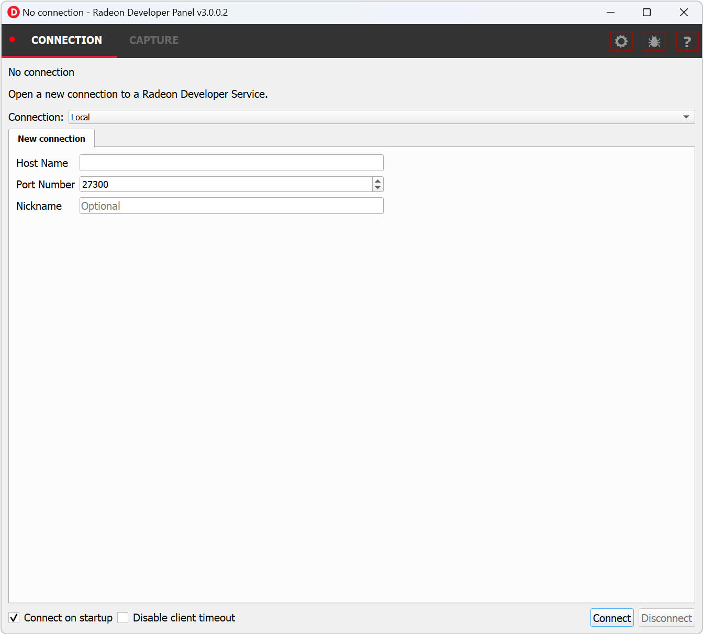

Initial setup
=============

.. IMPORTANT::
      The application you want to profile, trace or capture scenes from must **NOT** already be
      running. The panel needs to be configured in advance of starting your
      application.

1) Start the **RadeonDeveloperPanel(.exe)** on your local system. The
   panel will startup up with the Connection tab already highlighted
   (see below).

..

   The connection panel has three main elements:

-  **Connection status** - to the Radeon Developer Service (currently
   not connected)

-  **Connection dropdown** - choose a previous connection to connect to. **Local** will always
   be available in this list

-  **New connection** - section that allows you specify a new remote connection. New connections
   will be added to the connections list

2) Connect to a **Local** or **Remote** connection:

      Select an entry from the Connection dropdown,
      then click the “Connect” button. This will attempt to establish a connection to a **Radeon Developer Service**

Note that the red indicator to the left of the “CONNECTION” tab will change to
green to indicate that the connection was successful.

Connections to applications will timeout after a brief period of no API calls being made. For example, a timeout will likely occur when a 
connected application is suspended by a debug breakpoint or if the application is only occasionally refreshing.
Enabling the "Disable client timeout" toggle will stop Radeon Developer Panel disconnecting from inactive clients.

.. NOTE::
   For Local connections, starting **Radeon Developer Service** is optional.
   For Remote Connections, a **Radeon Developer Service** instance must be started on the remote machine (see below)