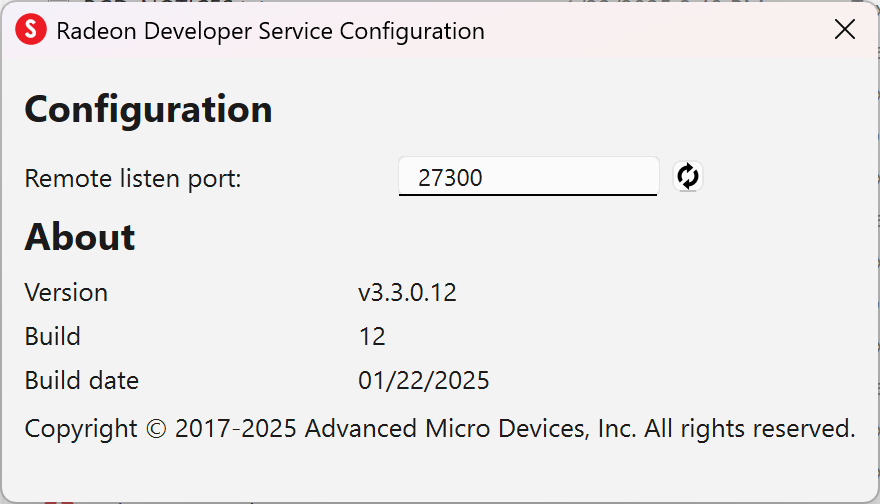

The Radeon Developer Service
============================

Two versions of the Radeon developer service are provided, one with a
configuration UI and system tray icon, and one designed for use with
headless GPU system where no UI can be supported.

Radeon Developer Service for desktop developer system
-----------------------------------------------------

RadeonDeveloperService(.exe) - Can be used for general use where the
system has a monitor and UI (e.g. desktop development machines). The
Radeon Developer Service includes a configuration window containing
basic service configuration settings and software info. **Double click
the Radeon Developer Service system tray icon** to open the
configuration window, or right-click on the system tray icon and select
'configure' from the context menu.

-  **Listen port** - The port that the Radeon Developer Service uses to
   listen for incoming connections from a remote Radeon Developer Panel.
   **The default port is 27300**. Altering the port will disconnect all
   existing sessions. The circular arrows icon to the right of the
   Listen port field can be clicked to reset the port to the default
   value.

-  **Version info** - Software version information for the Radeon
   Developer Service.

Double click the Radeon Developer Service system tray icon again or
right-click on the system tray icon and select 'configure' from the
context menu to close the configuration window.

.. IMPORTANT::
    When running both the Radeon Developer Panel and
    the Radeon Developer Service on the same system the communication
    between the two uses pipes, not sockets and ports, so setting the port
    has no effect.

Radeon Developer Service for headless GPU systems
-------------------------------------------------

RadeonDeveloperServiceCLI(.exe) - Command line version for use with
headless GPU systems where no UI can be provided. This version can
also run on a system that has a monitor and UI.

The following command line options are available for
RadeonDeveloperServiceCLI:

1) **-- port <port number>** *Overrides the default listener port used
   by the service (27300 is the default).*

.. NOTE::
    The service will need to be explicitly started
    before starting the Radeon Developer Panel. If the service isn't
    running, the Radeon Developer Panel will automatically start the UI
    version of the Radeon Developer Service, which may not be what is
    required.

