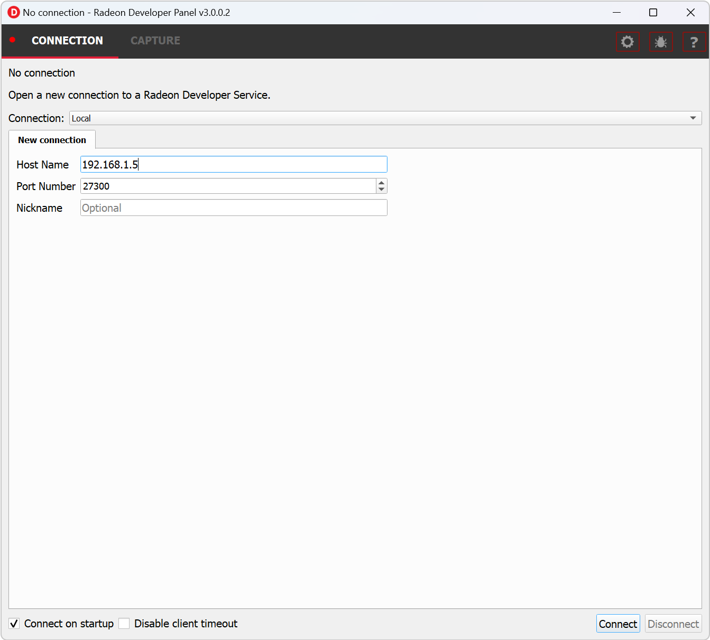

Remote connections
==================

1) Start the **RadeonDeveloperService(.exe)** on the **remote** system (the machine
where the application is to be run). Make a note of the remote system's IP address
(open a command prompt and type 'ipconfig').

2) Start the **RadeonDeveloperPanel(.exe)** on the local system. On the **CONNECTION**
tab, enter the IP address of the **remote** system in the **Host name** and then
click the  “Connect” button.

Optionally a nickname for the connection can be provided. This name will show in parentheses in the Connection dropdown.

