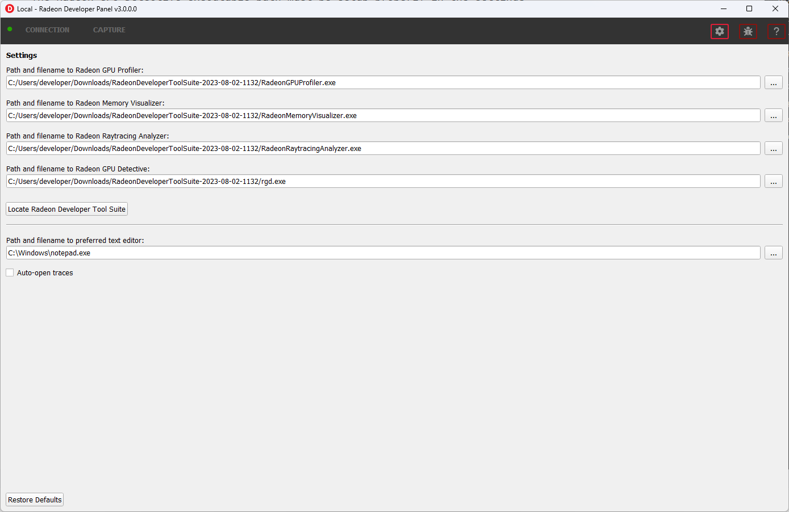

Settings
========

At any time the Radeon Developer Panel settings can be accessed by clicking the gear button in the upper right corner. This will open the
settings pane.

After capturing a profile, trace or scene from an application, it is often desirable to open the output
file using the associated tool such as **Radeon GPU Profiler**, **Radeon Memory Visualizer**, **Radeon Raytracing Analyzer**, or **Radeon GPU Detective**.

The settings pane allows for choosing the global path to the tool to be used by Radeon Developer Panel to open
captured profiles, traces and scenes. For convenience, using the **Locate Radeon Developer Tool Suite** button will allow for selection
of a downloaded Radeon Developer Tool Suite package and automatically configure all paths.

Additionally, the settings pane contains the **Auto open traces** toggle which will cause Radeon Developer Panel to open a captured
profile, trace or scene with the correct tool as soon as it is captured.

A **Restore Defaults** button allows for resetting the path and auto open settings to their default values. For the paths, this
will reset them to the panel's executable path directory.

